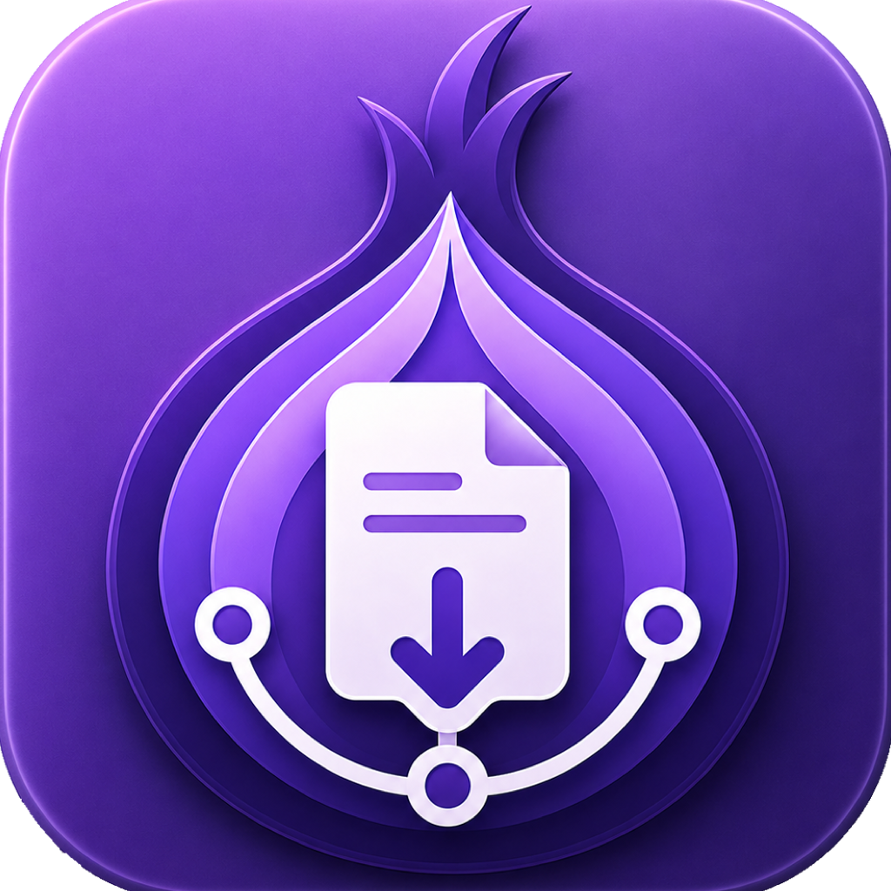
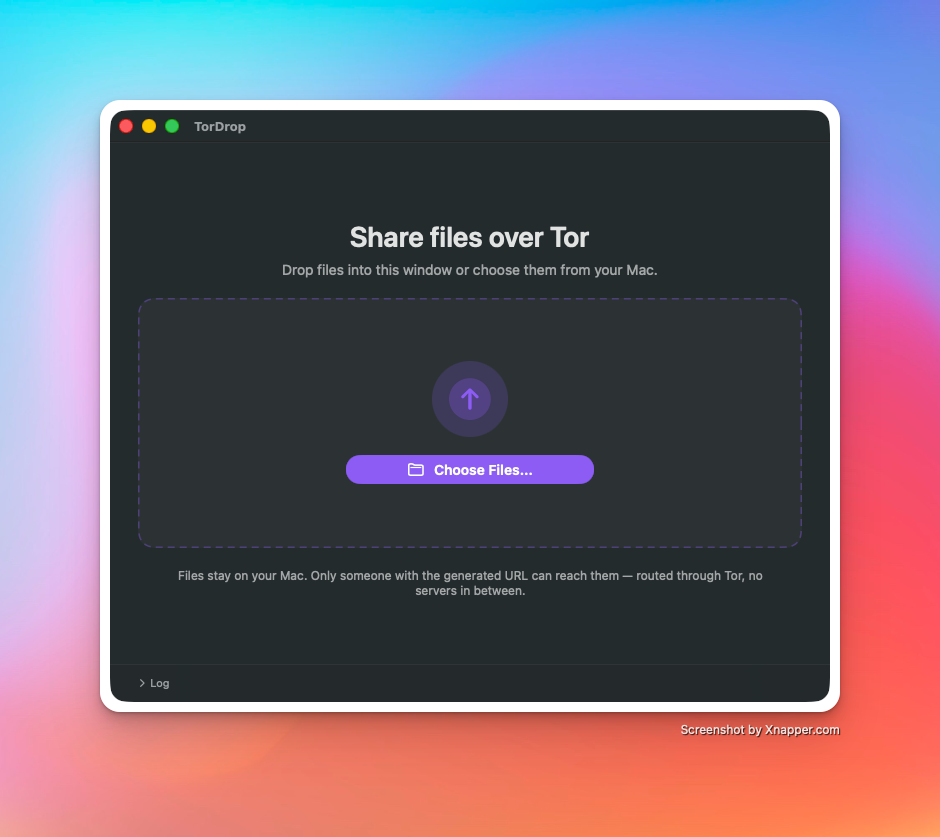
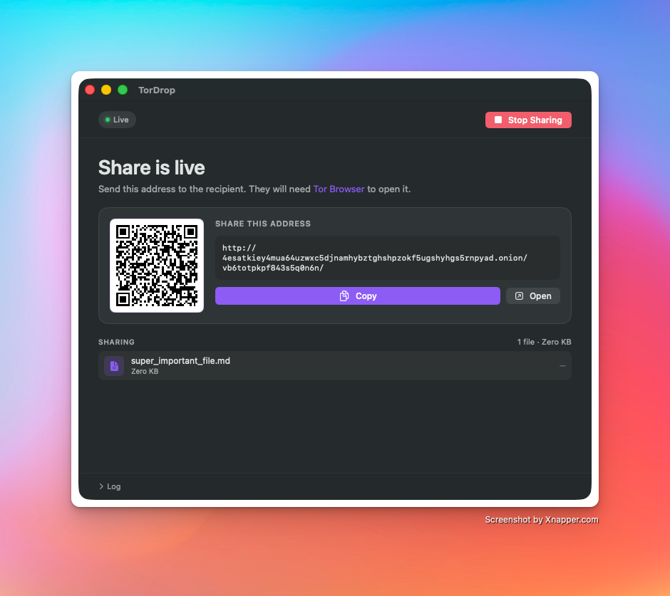

<p align="center">
  
</p>

<h1 align="center">TorDrop</h1>

<p align="center">
  <i>Share files over the Tor network — from a small native macOS app.</i>
</p>

<p align="center">
  Pick files, get a <code>.onion</code> URL, hand it off. No accounts, no third-party servers,
  no persistent onion keys. Built as a small native SwiftUI app with <code>tor</code> as its only
  external dependency.
</p>

<p align="center">
  
  
</p>

---

## How it works

```
File → local HTTP server (127.0.0.1:random) → tor → v3 onion service → Recipient
```

1. You pick one or more files — drag them into the TorDrop window, or use the file picker.
2. TorDrop starts a minimal HTTP server on a random loopback port, listing the files under a random URL slug.
3. TorDrop spawns `tor`, connects to its control port, and creates an ephemeral v3 hidden service (`ADD_ONION NEW:ED25519-V3 Flags=DiscardPK`) that forwards onion port 80 to the local HTTP port.
4. You copy the `.onion` URL (or scan the in-app QR code with a phone) and send it to the recipient over any secure channel.
5. The recipient opens it in Tor Browser and downloads.
6. You click **Stop Sharing** and the onion service vanishes — the private key was never written to disk.

While a share is starting or live, TorDrop also shows a temporary menu bar status icon. Clicking it brings the main window forward; dropping files on it starts a new share. When TorDrop is idle, the menu bar icon is hidden.

## Requirements

- macOS 13 (Ventura) or later
- Xcode command-line tools (for `swift build`)
- The `tor` daemon:
  ```sh
  brew install tor
  ```
  TorDrop looks in `/opt/homebrew/bin/tor`, `/usr/local/bin/tor`, `/opt/local/bin/tor`, and falls back to `which tor`.

## Build & run

```sh
make app        # produces TorDrop.app
make run        # builds and launches it
```

Or during development:

```sh
swift run -c release
```

The first launch might prompt for network permissions (the local listener and the outbound connection `tor` makes). Local development builds are ad-hoc signed, so you may need to right-click → Open the first time.

TorDrop is a regular macOS app: it appears in the Dock, has a standard app menu, and supports `Cmd-Q` to quit.

## Release signing

`make app` always signs and verifies the app bundle. By default it uses an ad-hoc signature, which does not identify the developer but does produce a sealed app bundle. Downloaded ad-hoc releases should trigger a Gatekeeper warning such as "unidentified developer" rather than "damaged".

Users can open ad-hoc releases with right-click → Open. If macOS still reports that a downloaded ad-hoc build is damaged, remove the download quarantine attribute:

```sh
xattr -dr com.apple.quarantine /Applications/TorDrop.app
```

Developer ID signing and notarization are optional. They remove the Gatekeeper warning for public releases, but require a paid Apple Developer account.

The GitHub release workflow will use Developer ID signing and notarization when these repository secrets are configured:

- `APPLE_CERTIFICATE_P12_BASE64`: base64-encoded Developer ID Application `.p12`
- `APPLE_CERTIFICATE_PASSWORD`: password for the `.p12`
- `APPLE_DEVELOPER_ID_APPLICATION`: signing identity, for example `Developer ID Application: Example, Inc. (TEAMID1234)`
- `KEYCHAIN_PASSWORD`: temporary CI keychain password
- `APPLE_NOTARY_KEY`: App Store Connect API private key contents
- `APPLE_NOTARY_KEY_ID`: App Store Connect API key ID
- `APPLE_NOTARY_ISSUER_ID`: App Store Connect issuer ID

## Project layout

```
Sources/TorDrop/
├── main.swift                # Entry point (regular app activation policy)
├── AppDelegate.swift         # App lifecycle
├── MainWindowController.swift # Main app window
├── MenuBarController.swift   # Active-share NSStatusItem + icon
├── MenuBarDropView.swift     # File-drop overlay for the active-share menu bar icon
├── MainView.swift            # SwiftUI app surface
├── QRCode.swift              # CoreImage QR code generator + view
├── ShareState.swift          # Observable state shared with the UI
├── ShareManager.swift        # Orchestrates FileServer + TorController
├── FileServer.swift          # HTTP/1.1 server on Network.framework
└── TorController.swift       # Tor subprocess + control protocol client
Resources/AppIcon.png         # 1024x1024 source artwork for README + app icon
Scripts/normalize_icon_pngs.swift # Strips PNG metadata before iconutil builds AppIcon.icns
```

## Security notes

- **Ephemeral onion keys.** `Flags=DiscardPK` tells tor not to hand us the private key; the service identity dies with the process.
- **Random URL slug.** Files live under a `/<20 chars>/...` path so the raw onion address alone isn't a direct handle on them. Defense in depth, not a secret.
- **Loopback-only HTTP.** The embedded server binds to `127.0.0.1`, so it is never reachable outside of tor.
- **Scope.** TorDrop does not add anything beyond what Tor itself provides for recipient anonymity or integrity. For sensitive content, confirm the URL reached the intended recipient through a trusted channel.

## License

TorDrop is released under the [MIT License](LICENSE).
